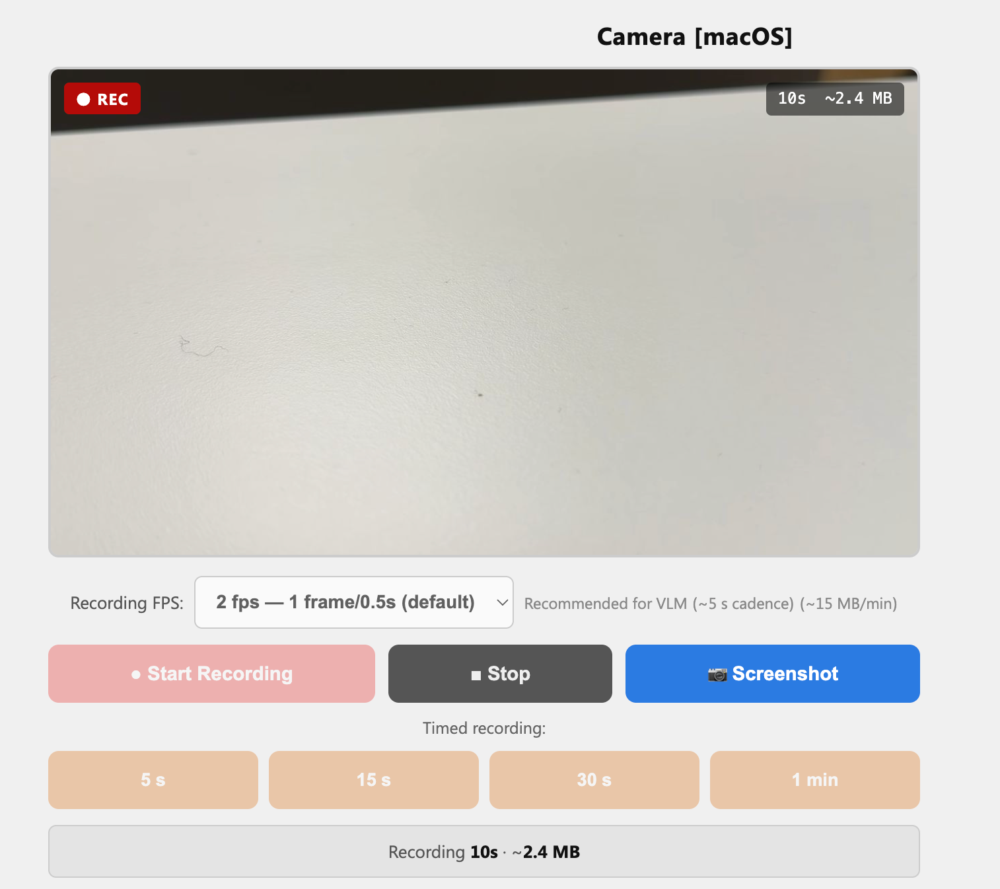

# Data Collection

This folder contains the camera server used to record videos from the Raspberry Pi mounted on the lawnmower.

## How it looks


## What it does

`camera_server.py` starts a Flask web server that streams the Pi camera live and lets you record AVI video files directly from your browser. Recordings are saved automatically to the Pi.

## How to use

**1. Start the server on the Pi**

```bash
python camera_server.py
```

**2. Open the web interface**

On any device connected to the same network, open:

```
http://192.168.4.1:5555
```

**3. Record a video**

- Choose a recording FPS in the selector
- Press "Start Recording", then "Stop" when done
- The file is saved automatically as an AVI on the Pi

**4. Copy recordings for processing**

Recordings are saved on the Pi at `/home/pi/recordings/`. 